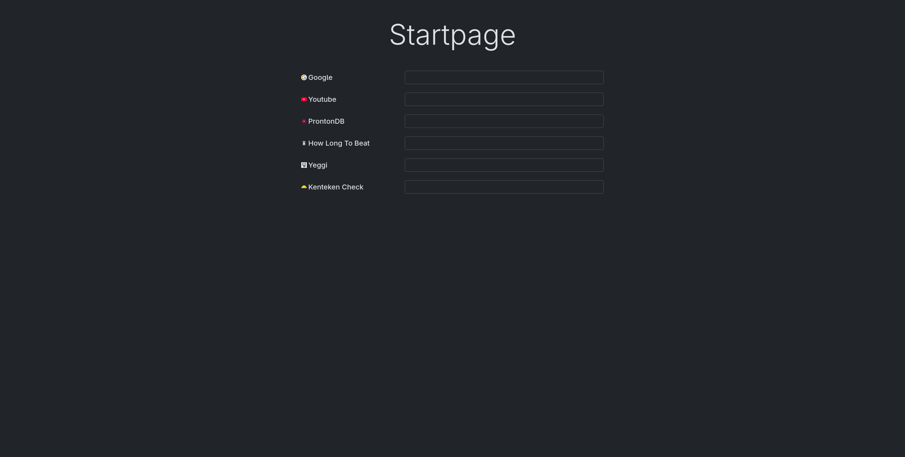

# Browser Homepage

A simple browser homepage with a list of search engines. It consists of a single HTML and a single Javascript file. Bootstrap and Jquery are used for styling and dynamic rendering of the search engines. The page automatically switches between light and dark mode based on your browser's preferred theme. Search engines can be added by adding them to the `SEARCH_ENGINES` list in `homepage.js`.

## Installation (for firefox) (on unix systems)

1. Clone this repository
```shell
git clone https://github.com/DigitalHungerTM/browser-homepage.git
```

2. open `browser-homepage/homepage.html` in firefox

3. Copy the URL, probably something like `file:///home/.../browser-homepage/homepage.html`

4. Set `browser-homepage.homepage.html` as the homepage URL in your browser. For firefox:  
  `Settings` -> `Home` -> `Homepage and new windows` -> Select `custom URL` and paste the URL you copied

5. Click the home button in firefox and enjoy!

## Screenshot


